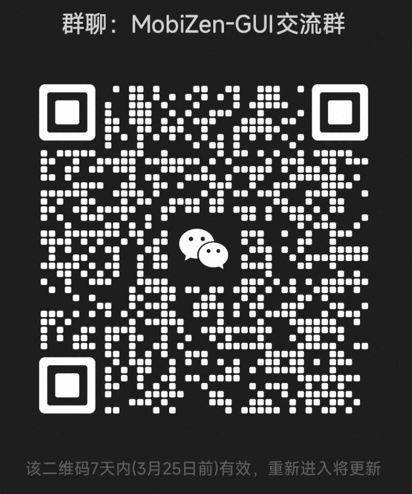

# <p align="center"><b>MobiZen-GUI</b></p>

<p align="center">
🌐 <a href="https://huggingface.co/alibabagroup/MobiZen-GUI-4B">Model in Hugging Face</a>  |
🌐 <a href="https://modelscope.cn/models/GUIAgent/MobiZen-GUI-4B">Model in ModelScope</a>  |
💻 <a href="./demo/">Demo</a>  |
📄 <a href="https://huggingface.co/datasets/alibabagroup/CMGUI">Chinese Trajectory Data</a>
</p>

<p align="center">
  <a href="./README.md">English</a> |
  <a href="./README_CN.md">简体中文</a>
</p>

**MobiZen-GUI** is an extensible mobile automation framework that uses vision-language models to control Android devices through natural language instructions. The name combines **"Mobile"** and **"Zen" (禅)**, representing the philosophy of intelligent, effortless mobile automation.

MobiZen-GUI ia trained on a large, hand-curated corpus of **Chinese mobile GUI interactions**, the model has learned from hundreds of thousands of real app sessions spanning e-commerce, transport, social, and finance. Each record includes screenshots, touch traces, and Chinese instructions, giving the agent deep insight into Chinese UI conventions and workflows.

The goal of MobiZen-GUI is to make it easier—and faster—to build and ship Mobile GUI agents. It delivers:

  - A 4-billion-parameter agent that runs completely on your own desktop or laptop.
  - Fast execution speed, relying only on a single image and historical actions. It relies solely on a single current image and historical actions, requiring no additional information, resulting in fast execution speed.
  - A turnkey inference kit that auto-handles ADB links and pulls in every required library.

## Application Demonstrations

Instruction: 打开12306，帮我订一张本周六早上八点零八分从济南出发到上海的高铁票，只看高铁和动车, 预定二等座 (Open the 12306 app and book a high-speed train ticket for me from Jinan to Shanghai this Saturday at 8:08 AM.  Only show high-speed and bullet trains, and book a second-class seat)

**[Click to view demo video](./demo/video_1_compressed.gif)**

  <div style="display: flex; align-items: left; justify-content: left; width: 80%; margin: 0 auto;">
    
  </div>
<br><br>
Instruction: 打开哔哩哔哩，开启睡眠提醒 (Open Bilibili and enable sleep reminders)

**[Click to view demo video](./demo/video_2_compressed.gif)**

  <div style="display: flex; align-items: left; justify-content: left; width: 80%; margin: 0 auto;">
    
  </div>

Instruction: 打开小红书，在"我"的页面里 查看关注列表，并把关注列表的第三个人取消关注；然后回到"首页"的发现页面，搜索"派大星"然后进入"用户"tab，关注第二个账号；最后回到手机主页面，在拼多多里面搜 索"儿童成长牛奶"并查看第一个商品的用户评价，然后回到手机主页面 (Open Xiaohongshu, go to your profile page and view your following list, then unfollow the third person on the list; then go back to the "Homepage" discovery page, search for "Patrick Star," and go to the "Users" tab, and follow the second account; finally, return to your phone's home screen, search for "children's growth milk" on Pinduoduo and view the user reviews of the first product, then return to your phone's home screen)

**[Click to view demo video](./demo/video_3_compressed.gif)**

  <div style="display: flex; align-items: left; justify-content: left; width: 80%; margin: 0 auto;">
    
  </div>
<br><br>
Instruction: 打开计算器，计算5.5535*3.33 (Open the calculator and calculate 5.5535 * 3.33)

**[Click to view demo video](./demo/video_4_compressed.gif)**

  <div style="display: flex; align-items: left; justify-content: left; width: 80%; margin: 0 auto;">
    
  </div>
<br><br>
Instruction: 去飞猪查询2月27日去，3月4日回，广州到莫斯科的往返机票, 无需购买 (Check on Fliggy for round-trip flights from Guangzhou to Moscow, departing on February 27th and returning on March 4th. No purchase is required)

**[Click to view demo video](./demo/video_5_compressed.gif)**

  <div style="display: flex; align-items: left; justify-content: left; width: 80%; margin: 0 auto;">
    
  </div>

## Prerequisites

### 1. Install ADB (Android Debug Bridge)

**macOS:**
```bash
brew install android-platform-tools
```

**Linux:**
```bash
sudo apt-get install android-tools-adb
```

**Windows:**
Download from [Android Developer Site](https://developer.android.com/studio/releases/platform-tools)

Verify installation:
```bash
adb version
```

### 2. Install ADBKeyboard on Test Device

ADBKeyboard is required for text input (especially for Chinese characters).

1. Download [ADBKeyboard.apk](https://github.com/senzhk/ADBKeyBoard)
2. Install on your device:
```bash
adb install ADBKeyboard.apk
```
3. Enable ADBKeyboard in device settings: Settings → System → Languages & Input → Virtual Keyboard → Enable ADBKeyboard

### 3. Connect Your Device

**USB Connection:**
```bash
adb devices
```

**Wireless Connection:**
```bash
adb tcpip 5555
adb connect <device-ip>:5555
```

## Quick Start

### 1. Clone the Project

```bash
git clone https://github.com/yourusername/MobiZen-GUI.git
cd MobiZen-GUI
```

### 2. Install Dependencies

**Using uv (Recommended):**
```bash
uv venv
source .venv/bin/activate  # On Windows: .venv\Scripts\activate
uv pip install -r requirements.txt
```

**Using pip:**
```bash
pip install -r requirements.txt
```

### 3. Configure Your Agent

Copy the example config and edit with your settings:

```bash
cp config_example.yaml my_config.yaml
```

Edit `my_config.yaml`:

```yaml
device_id: null  # Auto-detect first device
api_key: "your-api-key-here"
base_url: "https://api.openai.com/v1"
model_name: "gpt-4o"
model_type: "qwen3vl"
use_adbkeyboard: true
```

### 4. Run the Agent

```bash
python main.py --config my_config.yaml --instruction "Open RedNote, find the chat with John, and send him 'Hello'"
```

## Model Options

### Option 1: Use MobiZen-GUI-4B (Recommended)

We provide a pre-trained model **MobiZen-GUI-4B** optimized for mobile automation tasks. Note: The vLLM version requirement for deploying MobiZen-GUI-4B is: vllm==0.11.0

**Download the model:**
```bash
pip install -U huggingface_hub
export HF_ENDPOINT=https://hf-mirror.com
hf download alibabagroup/MobiZen-GUI-4B --local-dir .
```

**Deploy with vLLM:**

```bash
pip install vllm==0.11.0

vllm serve /path/to/MobiZen-GUI-4B \
  --host 0.0.0.0 \
  --port 8000 \
  --trust-remote-code
```

**Update your config:**
```yaml
base_url: "http://localhost:8000/v1"
model_name: "MobiZen-GUI-4B"
model_type: "qwen3vl"
```

### Option 2: Use OpenAI-Compatible Models

MobiZen-GUI supports **any model that follows the OpenAI API format**. This includes:

- **OpenAI Models**: GPT-4o, GPT-4o-mini, etc.
- **Cloud Providers**: Azure OpenAI, AWS Bedrock (with OpenAI compatibility), etc.
- **Local Deployments**: vLLM, Ollama, LM Studio, Text Generation WebUI (OpenAI mode)
- **Other Providers**: DeepSeek, Moonshot, Zhipu AI, etc.

**Example with different providers:**

```yaml
# OpenAI
base_url: "https://api.openai.com/v1"
api_key: "sk-..."
model_name: "gpt-4o"

# Azure OpenAI
base_url: "https://your-resource.openai.azure.com/openai/deployments/your-deployment"
api_key: "your-azure-key"
model_name: "gpt-4o"

# vLLM (local or remote)
base_url: "http://localhost:8000/v1"
api_key: "dummy"
model_name: "your-model-name"

# Ollama (with OpenAI compatibility)
base_url: "http://localhost:11434/v1"
api_key: "dummy"
model_name: "llava"
```

### Option 3: Custom Model Implementation

If your model doesn't support OpenAI format, you can implement a custom client:

```python
from core.model_clients.base import BaseModelClient

class MyModelClient(BaseModelClient):
    def chat(self, messages, **kwargs):
        # Your custom implementation
        pass
```

Then specify in config:
```yaml
model_client_class: "my_module.MyModelClient"
model_client_kwargs:
  model_path: "/path/to/model"
```

## Configuration Reference

### Essential Settings

| Parameter | Description | Default |
|-----------|-------------|---------|
| `device_id` | ADB device ID (null for auto-detect) | `null` |
| `api_key` | API key for model service | Required |
| `base_url` | API endpoint URL | Required |
| `model_name` | Model name | Required |
| `model_type` | Model type for coordinate transformation | `qwen3vl` |
| `use_adbkeyboard` | Use ADBKeyboard for text input | `true` |

### Execution Settings

| Parameter | Description | Default |
|-----------|-------------|---------|
| `max_steps` | Maximum steps per task | `25` |
| `step_delay` | Delay between steps (seconds) | `2.0` |
| `first_step_delay` | Delay after first step (seconds) | `4.0` |
| `screenshot_dir` | Directory for screenshots | `./screenshots` |

### Model Parameters

| Parameter | Description | Default |
|-----------|-------------|---------|
| `temperature` | Sampling temperature | `0.1` |
| `top_p` | Top-p sampling | `0.001` |
| `max_tokens` | Maximum output tokens | `1024` |
| `timeout` | Request timeout (seconds) | `60` |

See `config_example.yaml` or `config_example.json` for complete configuration examples.

## Examples

### Basic Usage

```bash
# Open an app
python main.py --config my_config.yaml --instruction "Open Zhihu"

# Perform complex task
python main.py --config my_config.yaml --instruction "Search for restaurants nearby on Amap"

# Multi-step task
python main.py --config my_config.yaml --instruction "Open RedNote, find the chat with John, and send him 'Hello'"
```

### Python API

```python
from config import AgentConfig
from core.agent import MobileAgent

# Load config from file
config = AgentConfig.from_file("my_config.yaml")

# Create agent
agent = MobileAgent(
    config=config,
    message_builder=config.create_message_builder(),
    model_client=config.create_model_client(),
    response_parser=config.create_response_parser()
)

# Run task
history = agent.run("Open Settings and enable WiFi")

# Access execution history
for step in history:
    print(f"Step: {step['subtask']}")
    print(f"Action: {step['action']}")
```

## Supported Actions

The agent can perform the following actions:

- **click**: Tap at specific coordinates
- **long_press**: Long press at coordinates
- **swipe**: Swipe from one point to another
- **type**: Input text (supports Chinese via ADBKeyboard)
- **system_button**: Press Back/Home/Enter/Menu buttons
- **wait**: Wait for specified duration
- **terminate**: End task execution

## Troubleshooting

**Device not detected:**
```bash
adb devices
# If empty, check USB connection or wireless connection
```

**ADBKeyboard not working:**
- Make sure ADBKeyboard is installed and enabled in device settings
- Test with: `adb shell am broadcast -a ADB_INPUT_TEXT --es msg "test"`

**Model connection error:**
- Verify `base_url` and `api_key` in config
- Check network connectivity
- Ensure API endpoint is accessible

**Coordinate transformation issues:**
- Verify `model_type` matches your model (qwen3vl or qwen25vl)
- Check device screen resolution with: `adb shell wm size`

## Todo

- ✅ Release the GUI model [MobiZen-GUI-4B](https://huggingface.co/alibabagroup/MobiZen-GUI-4B)
- ✅ Release the high-quality training and evaluation corpus of [Chinese trajectory data](https://huggingface.co/datasets/alibabagroup/CMGUI)
- ☐ Construct a skill.md for the popular OpenClaw
- ☐ Support more GUI models, such as MAI-UI, Qwen3.5, GeLab-Zero

## License

Apache License 2.0

## Contact

You can contact us and communicate with us by joining our WeChat group:

| WeChat Group |
|:-------------------------:|
|  |